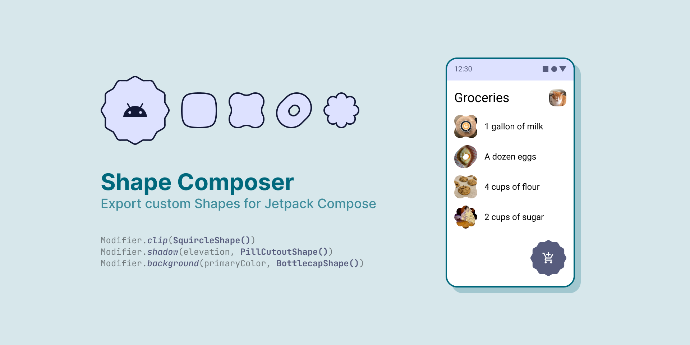
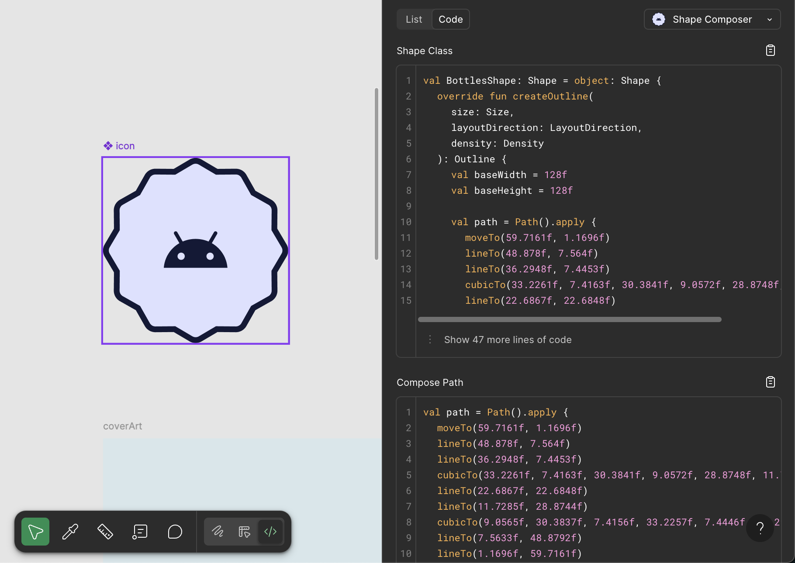

# Shape Composer Figma plugin

[Codegen DevMode plugin](https://www.figma.com/plugin-docs/codegen-plugins/) that exports vectors as custom Shape classes to use in a [Jetpack Compose](https://developer.android.com/jetpack/compose) app.



Essentially, the path data from a Figma [VectorNode](https://www.figma.com/plugin-docs/api/VectorNode/) is translated into [Path commands](https://developer.android.com/reference/kotlin/androidx/compose/ui/graphics/Path) to be recreated in Android, with some extra wrapping around a [Shape class](https://developer.android.com/reference/kotlin/androidx/compose/ui/graphics/Shape) to easily copy-paste into the project.

Clover shape example:


```kotlin
val CloverShape: Shape = object: Shape {
    override fun createOutline(
        size: Size,
        layoutDirection: LayoutDirection,
        density: Density
    ): Outline {
        val baseWidth = 200f
        val baseHeight = 200f

        val path = Path().apply {
            moveTo(12f, 100f)
            cubicTo(12f, 76f, 0f, 77.6142f, 0f, 50f)
            cubicTo(0f, 22.3858f, 22.3858f, 0f, 50f, 0f)
            cubicTo(77.6142f, 0f, 76f, 12f, 100f, 12f)
            cubicTo(124f, 12f, 122.3858f, 0f, 150f, 0f)
            cubicTo(177.6142f, 0f, 200f, 22.3858f, 200f, 50f)
            cubicTo(200f, 77.6142f, 188f, 76f, 188f, 100f)
            cubicTo(188f, 124f, 200f, 122.3858f, 200f, 150f)
            cubicTo(200f, 177.6142f, 177.6142f, 200f, 150f, 200f)
            cubicTo(122.3858f, 200f, 124f, 188f, 100f, 188f)
            cubicTo(76f, 188f, 77.6142f, 200f, 50f, 200f)
            cubicTo(22.3858f, 200f, 0f, 177.6142f, 0f, 150f)
            cubicTo(0f, 122.3858f, 12f, 124f, 12f, 100f)
            close()
        }
        
        return Outline.Generic(
            path
                .asAndroidPath()
                .apply {
                    transform(Matrix().apply {
                        setScale(size.width / baseWidth, size.height / baseHeight)
                    })
                }
                .asComposePath()
        )
    }
}
```

Unsupported path commands:

- Vertical line to (V, v)
- Horizontal line to (H, h)
- Smooth curve to (S, s)
- Smooth quadratic curve to (T, t)
- Elliptical Arc (A, a)

## Setup

1. Clone this repo
2. `npm install` in cloned directory to install dependencies
3. Import plugin for local development in Figma desktop app, using `manifest.json`
4. Run `npm start` to start development server and Typescript watcher
5. Use plugin in Figma!

## Current designed workflow

1. Select Vector layer in Figma (flatten if necessary)
2. Execute plugin action
3. Paste copied class from clipboard into Compose project
